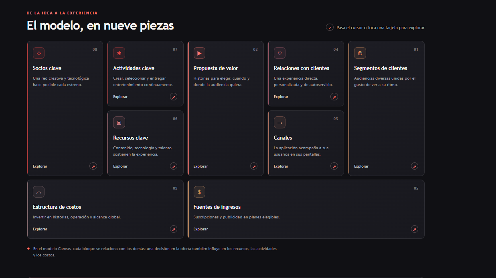

# Práctica 03 · Modelo Canvas de Netflix

## Acceso al modelo

🔗 **GitHub Pages:** [Abrir el Modelo Canvas de Netflix](https://sayuridbc.github.io/PRACTICAS_INTEGRADORA_230770/)

También puedes abrir el [sitio desde este repositorio](index.html).

## Propósito

Esta práctica aplica el Modelo Canvas para describir cómo Netflix crea, entrega y captura valor en el sector del entretenimiento digital. La página presenta los nueve bloques y explica cómo se relacionan para sostener el servicio.

## Los nueve bloques

1. **Segmentos de clientes:** personas y hogares con hábitos y preferencias de entretenimiento diversos.
2. **Propuesta de valor:** contenido bajo demanda, variedad, personalización y acceso desde dispositivos compatibles.
3. **Canales:** sitio web y aplicaciones para televisores, móviles, computadoras, tabletas, consolas y dispositivos de streaming.
4. **Relaciones con clientes:** perfiles, recomendaciones, autoservicio y soporte digital.
5. **Fuentes de ingresos:** principalmente suscripciones y, en mercados y planes elegibles, publicidad.
6. **Recursos clave:** catálogo y derechos, marca, plataforma tecnológica, datos, infraestructura y talento.
7. **Actividades clave:** producir y licenciar contenido, operar la plataforma, personalizar la experiencia y promocionar estrenos.
8. **Socios clave:** productoras, titulares de derechos, creadores, talento, proveedores tecnológicos y fabricantes de dispositivos.
9. **Estructura de costos:** contenido, producción, tecnología, operación, personal y marketing.

## Cómo explorar

Selecciona o toca cualquiera de las tarjetas para desplegar su explicación y ejemplos. La página está construida con HTML, CSS y JavaScript, no requiere instalación ni dependencias externas, y se adapta a distintos tamaños de pantalla.

## Archivos de la práctica

- [Página interactiva](index.html)
- [Estilos visuales](style.css)
- [Comportamiento interactivo](script.js)
- [Captura del modelo](modelo.png)

## Evidencia

Regresa al [índice de prácticas](../../README.md).