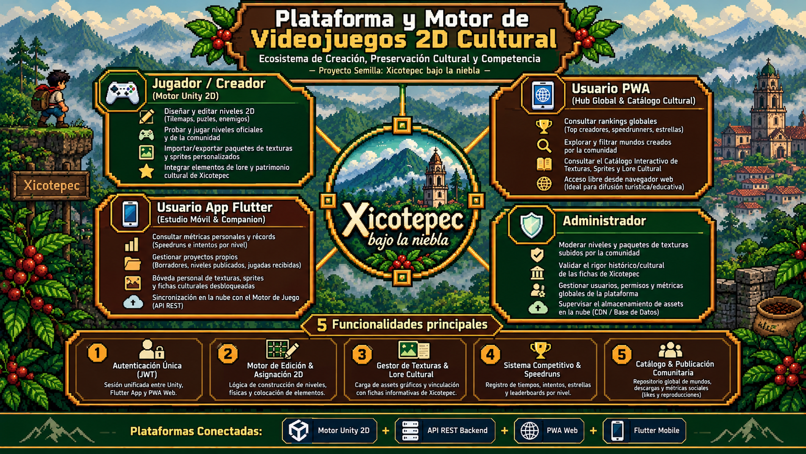

# Xicotepec bajo la niebla

**Sistema de Videojuego y Plataforma Cultural**

> Un proyecto que combina videojuegos, tecnología y difusión cultural para representar y dar a conocer la identidad de Xicotepec.

---

##  Descripción

**Xicotepec bajo la niebla** es un sistema compuesto por un videojuego y una plataforma cultural que busca ofrecer una experiencia interactiva basada en el municipio de **Xicotepec, Puebla**.

El proyecto integra diferentes tecnologías para permitir que los usuarios exploren información cultural mientras participan en una experiencia de videojuego con personajes, combates, resolución de puzles y habilidades especiales.

El sistema está dividido principalmente en:

-  **Videojuego:** experiencia interactiva para el jugador.
-  **Aplicación Flutter:** consulta de estadísticas, historial y progreso.
-  **PWA:** plataforma para consultar información cultural y rankings.
-  **Panel de administración:** gestión de usuarios, partidas e información del sistema.

---

##  Objetivos

- Promover el conocimiento de la cultura e identidad de Xicotepec.
- Integrar elementos culturales dentro de una experiencia de videojuego.
- Proporcionar una plataforma accesible para consultar información.
- Registrar y visualizar el progreso de los jugadores.
- Permitir la administración de usuarios, partidas y contenido.
- Crear una experiencia multiplataforma utilizando tecnologías modernas.

---

## 🎮 Funcionalidades principales

###  Jugador

El jugador puede:

- Controlar a los personajes **Balam, Rayo y Kiro**.
- Resolver diferentes puzles.
- Combatir contra enemigos.
- Utilizar habilidades y habilidades definitivas.
- Guardar y recuperar el progreso de sus partidas.

###  Usuario de la App Flutter

La aplicación móvil permite:

- Consultar el historial de partidas.
- Visualizar estadísticas personales.
- Consultar métricas individuales por personaje.
- Sincronizar las partidas.

###  Usuario de la PWA

La plataforma web permite:

- Consultar el ranking global.
- Explorar fichas culturales.
- Consultar puntuaciones.
- Explorar información relacionada con Xicotepec.

###  Administrador

El administrador cuenta con herramientas para:

- Gestionar usuarios.
- Supervisar partidas.
- Consultar datos del sistema.
- Gestionar información y contenido.

---

##  Características del videojuego

El videojuego cuenta con diferentes elementos que forman parte de la experiencia:

| Característica | Descripción |
|---|---|
|  Autenticación | Sistema de acceso compartido entre las plataformas |
|  Personajes | Control y cambio entre diferentes personajes |
|  Combate | Enfrentamientos y resolución de puzles |
|  Checkpoints | Recuperación del progreso durante la partida |
|  Estadísticas | Historial, puntuaciones y ranking |

---

##  Arquitectura del sistema

El proyecto integra tres componentes tecnológicos principales:

XICOTEPEC BAJO LA NIEBLA │ ┌───────────────┼───────────────┐ │ │ │ 🎮 Unity 2D 🌐 PWA 📱 Flutter │ │ │ └───────────────┼───────────────┘ │ Servicios / Datos │ ┌─────────┴─────────┐ │ │ Autenticación Información y partidas cultural

### Unity 2D

Se utiliza para el desarrollo del videojuego, incluyendo:

- Personajes.
- Escenarios.
- Enemigos.
- Combate.
- Puzles.
- Habilidades.
- Checkpoints.

### Flutter

Se utiliza para la aplicación móvil, enfocada principalmente en el seguimiento del jugador y sus estadísticas.

### PWA

La aplicación web permite consultar información cultural y funcionalidades como rankings y puntuaciones desde diferentes dispositivos.

---

##  Estructura del proyecto

Una posible estructura general es:

xicotepec-bajo-la-niebla/ │ ├── videojuego/ │ └── Unity/ │ ├── app/ │ └── Flutter/ │ ├── pwa/ │ └── Web/ │ ├── docs/ │ └── Documentación/ │ └── README.md

---

##  Flujo general del usuario

1. El usuario inicia sesión.
2. Puede acceder al videojuego o a las plataformas complementarias.
3. En el videojuego selecciona y controla a sus personajes.
4. Resuelve puzles y combate enemigos.
5. Su progreso y estadísticas pueden ser registrados.
6. Desde Flutter puede consultar su historial y métricas.
7. Desde la PWA puede consultar rankings e información cultural.
8. El administrador puede supervisar usuarios, partidas y contenido.

---

##  Impacto cultural

El proyecto busca utilizar la tecnología como medio para **difundir y preservar elementos culturales de Xicotepec**.

A través de la exploración, los personajes y las diferentes mecánicas del videojuego, se pretende generar una experiencia que no solamente sea entretenida, sino que también motive al usuario a conocer más sobre la historia, lugares y características culturales de la región.

---

##  Tecnologías

- **Unity 2D** — Desarrollo del videojuego.
- **Flutter** — Aplicación móvil.
- **PWA** — Plataforma web progresiva.
- **Git** — Control de versiones.
